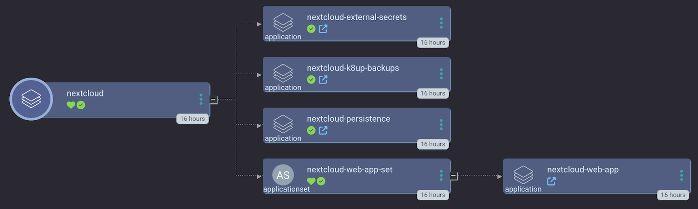

k8tz is a kubernetes admission controller and a CLI tool to inject timezones into Pods and CronJobs.

Containers do not inherit timezones from host machines and have only accessed to the clock from the kernel. The default timezone for most images is UTC, yet it is not guaranteed and may be different from container to container. With k8tz it is easy to standardize selected timezone across pods and namespaces automatically with minimal effort. https://github.com/k8tz

<br>

## Sync Wave

K8tz is deployed in the first sync wave since it configures a global behavior.

<br>

## Diagram 



<br>

## Deploy using ArgoCD

You should be able to just set argo to use this repo. There's an example template, `k8tz_argocd_appset.yaml`, for you to get started :) 

- From the CLI, run:

    ```bash
    argocd app create nextcloud -f k8tz_argocd_appset.yaml
    ```

- or via the ArgoCD GUI 

    ```yaml
    apiVersion: argoproj.io/v1alpha1
    kind: Application
    metadata:
      name: k8tz-argo-app
    spec:
      destination:
        namespace: k8tz
        server: 'https://kubernetes.default.svc'
      source:
        path: alpha/k8tz
        repoURL: 'https://github.com/small-hack/argocd-apps.git'
        targetRevision: HEAD
      sources: []
      project: default
      syncPolicy:
        automated:
          prune: true
          selfHeal: true
        syncOptions:
          - CreateNamespace=true
          - ApplyOutOfSyncOnly=true
    ```
