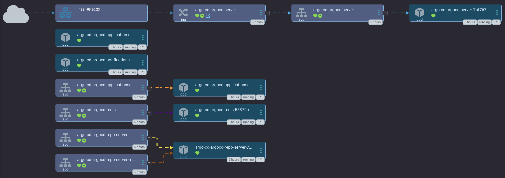

# Argo CD app
ArgoCD app for ArgoCD so that ArgoCD can manage itself, ArgoCD 🧡




## external secrets
When creating external secrets for argocd, don't forget to set `spec.target.template.metadata.labels` like:

```yaml
---
apiVersion: external-secrets.io/v1beta1
kind: ExternalSecret
metadata:
  name: argocd-keycloak
spec:
  target:
    # Name for the secret to be created on the cluster
    name: argocd-keycloak
    deletionPolicy: Delete
    template:
      type: Opaque
      metadata:
        labels:
          app.kubernetes.io/part-of: "argocd"
      data:
        oidc.keycloak.clientSecret: |-
          {{ .password }}
...
```

ref on external secrets labels: https://github.com/external-secrets/external-secrets/issues/2041


# Creating the Argo CD app
To deploy this, create a new Argo CD app, and select "Edit as YAML". Copy and paste this into the input field:
```yaml
project: default
source:
  repoURL: 'https://github.com/small-hack/argocd.git'
  path: argocd/
  targetRevision: main
destination:
  server: 'https://kubernetes.default.svc'
  namespace: argocd
syncPolicy:
  syncOptions:
    - ApplyOutOfSyncOnly=true
```

# setting up keycloak
Checkout out the [README](./keycloak) in the keycloak directory relative this this one for more info on how to setup an ArgoCD client for Keycloak.

This was put together from these older docs:
- https://argo-cd.readthedocs.io/en/stable/operator-manual/user-management/keycloak/
- https://argo-cd.readthedocs.io/en/stable/operator-manual/user-management/#example_1
