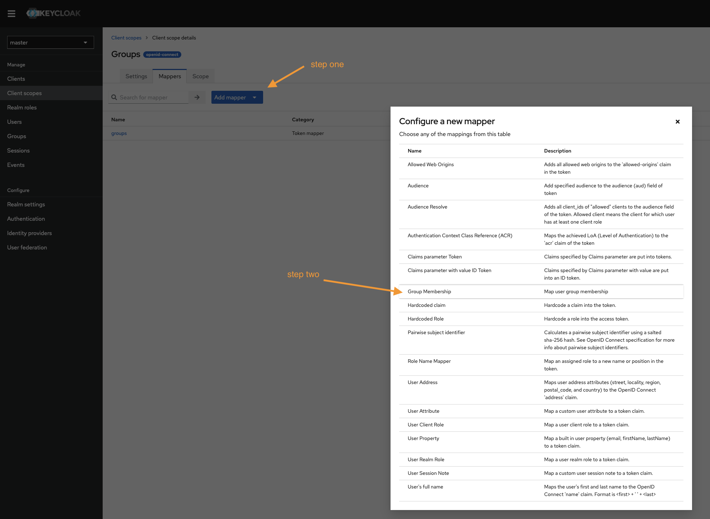
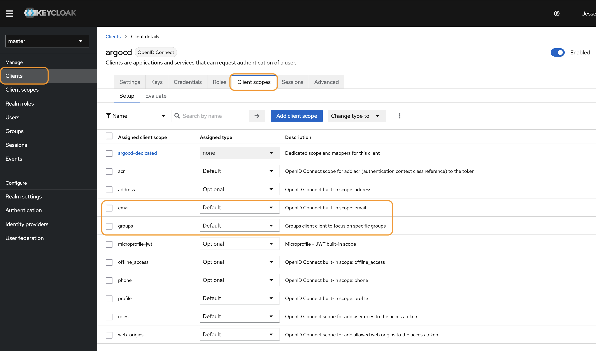
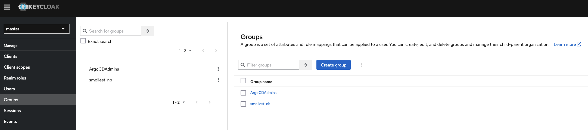

# steps to setup keycloak with argocd

1. Create a _Client_ with these values and nothing else:

2. Create a _Client Scope_ for groups:

3. Create a token mapper using _Group Membership_. You can find the menu to create that here after clicking the "Add Mapper" button:

And then make sure you fill out the Mapper details here like this:

4. Assign the new _**groups**_ _Client Scope_ to the argocd _Client_ we created earlier

5. create a group for use in the client

See more [here](https://argo-cd.readthedocs.io/en/stable/operator-manual/user-management/keycloak/#configuring-argocd-oidc) for the ArgoCD ConfigMap and Secret that need to be updated. Those are already configured via the helm values.yaml in small-hack/argocd, and the secrets live in this repo.
