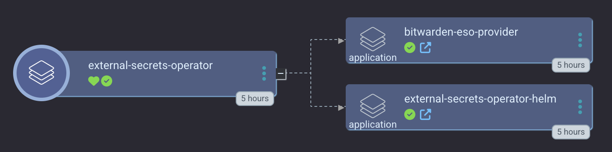
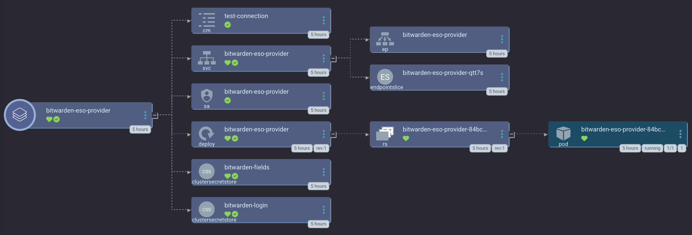

# External Secrets Operator

The [External Secrets Operator](https://external-secrets.io/latest/) (ESO) is a Kubernetes operator that integrates external secret management systems like AWS Secrets Manager, HashiCorp Vault, Google Secrets Manager, Azure Key Vault, IBM Cloud Secrets Manager, and many more. The operator reads information from external APIs and automatically injects the values into a Kubernetes Secret.

This Argo CD app of apps deploys both ESO and the [Bitwarden ESO Provider](https://github.com/small-hack/bitwarden-eso-provider/) so that you can use Bitwarden as your remote secret store.

## Sync waves
1. ESO
2. Bitwarden ESO provider (depends on ESO)

## Notes
If you'd like to deploy *only* ESO, please see [./external-secrets-operator/external_secrets_operator_argocd_app.yaml](./external-secrets-operator/external_secrets_operator_argocd_app.yaml).

Likewise, if you'd like to deploy *only* the Bitwarden ESO Provider, please see [./bitwarden/bitwarden_argocd_app.yaml](./bitwarden/bitwarden_argocd_app.yaml).
