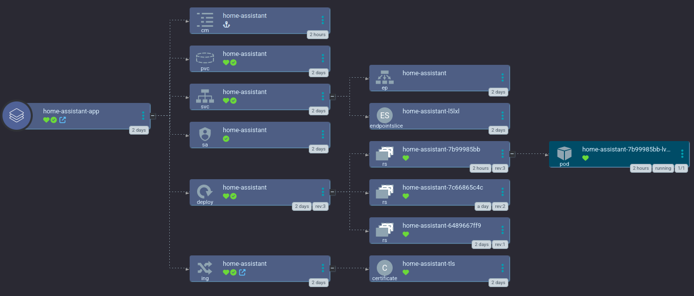

# Argo CD app for Home Assistant

[Home Assistant](https://home-assistant.io) is a home IOT management solution.

This app is just a single ApplicationSet using the [small-hack/home-assistant-chart](https://github.com/small-hack/home-assistant-chart/) helm chart that just takes a hostname and cluster issuer (for the TLS cert) for templating. It also includes default dark mode catppucin themes ready to go.

If you'd like to pass in devices, such as USB devices consider the app in the [toleration_and_affinity](./toleration_and_affinity) directory. (NOTE: still requires the [generic device plugin](../generic-device-plugin))
