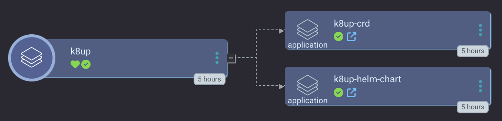

# K8up via ArgoCD
This directory is used to deploy a [k8up](https://github.com/k8up-io/k8up/) app via Argo CD. [K8up](https://k8up.io) is a kubernetes native backups utility that used [restic](https://restic.net/) under the hood to upload your data to an S3 endpoint.

## Sync Waves
1. k8up helm chart
