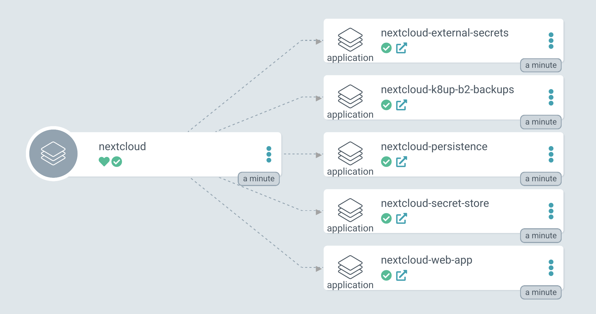

# NextCloud ArgoCD App of Apps
A NextCloud k8s repo for those who want to get started quickly with nextcloud on k3s the way we use it :) This project uses the official [nextcloud helm chart](https://github.com/nextcloud/helm/tree/main/charts/nextcloud). See the current version in [nextcloud_argocd_appset.yaml](./nextcloud_argocd_appset.yaml).

# Tech Stack

NextCloud would be running ontop of Kubernetes (we use k3s) and using the following additional k8s apps:

|       app/tool              |    what is it?       | Description                             |
|:----------------------------|:---------------------|:------------------------------------------------------------|
| [Ingress Nginx controller]  |  Ingress controller  | for routing external traffic to nextcloud                   |
| [External Secrets Operator] |  Secrets Management  | This allows us to keep secrets in Bitwarden                 |
| [k8up]                      |  Backups             | Use restic to backup k8s persistent volumes to Backblaze B2 |

(If you need a local cluster on linux, checkout [smol-k8s-lab] to try out both KIND and k3s)

## Argo CD Nextcloud app of apps

Here's a quick peak at what we're deploying with Argo CD.

#### Sync wave 1
- **External Secrets** are the actual secrets populated from the external secrets store. This includes things like the admin password.
- **Persistence** are the two persistent volumes needed to persist nextcloud data. This includes the postgresql database as well as the actual files we're storing in nextcloud

#### Sync wave 2
- **Nextcloud WebApp** is the actual nextcloud webapp deployed using Nginx. We're also using the bundled Bitnami Postgresql helm chart.

#### Sync wave 3
- **K8up B2 Backups** are the cronjobs needed for putting nextcloud into maintanence mode, as well as custom resource for backups, using Restic.

The Nextcloud WebApp also includes a metrics pod, postgres statefulset, and a redis cluster.




## Quick start (with a k8s cluster already running Argo CD)
You should be able to just set argo to use this repo. There's an example template, `nextcloud_argocd_template.yaml`, for you to get started :) You can run this from the cli:

```bash
argocd app create nextcloud -f nextcloud_argocd_template.yaml
```

## Tips
Check out the admin manual:
https://docs.nextcloud.com/server/latest/admin_manual/configuration_server/occ_command.html#scan

### Backups
Make sure that you follow this process for backups:

1. Run command to sync the files:
   ```bash
   kubectl exec $NEXTCLOUD_POD -- su -s /bin/bash www-data -c "php occ files:scan --all"
   ```

2. Put nextcloud into maintanence mode:
   ```bash
   kubectl exec $NEXTCLOUD_POD -- su -s /bin/bash www-data -c "php occ maintenance:mode --on"
   ```

3. Run the backup:
   You can run `kubectl apply -f root_backup.yaml` with [root_backup.yaml](./manifests/k8up_backups/root_backup.yaml)

4. Take nextcloud out of maintanence mode:
   ```bash
   kubectl exec $NEXTCLOUD_POD -- su -s /bin/bash www-data -c "php occ maintenance:mode --off"
   ```

#### Manual backups
Just in case you need to do a manual postgresql backup:
```bash
PGDATABASE="$POSTGRES_DB" PGUSER="$POSTGRES_USER" PGPASSWORD="$POSTGRES_PASSWORD" pg_dump --clean
```

### Restoring from backups
In the case of restores, please refer to the doc, [`manifests/restores/README.md`](./manifests/k8s_restores/README.md).

You may need to drop a table or two, requiring a psql shell and credentials. Connect to the postgresql pod and run:

```bash
PGDATABASE="$POSTGRES_DB" PGUSER="$POSTGRES_USER" PGPASSWORD="$POSTGRES_PASSWORD" psql
```

## Argo CD Project
```yaml
---
apiVersion: argoproj.io/v1alpha1
kind: AppProject
metadata:
  labels:
    env: prod
  name: nextcloud
  namespace: argocd
spec:
  clusterResourceWhitelist:
    - group: '*'
      kind: '*'
  description: all nextcloud apps
  destinations:
    - name: in-cluster
      namespace: nextcloud
      server: https://kubernetes.default.svc
    - name: '*'
      namespace: argocd
      server: '*'
  namespaceResourceWhitelist:
    - group: '*'
      kind: '*'
  orphanedResources: {}
  roles:
    - description: nextcloud admins
      name: nextcloud
      policies:
        - p, proj:nextcloud:nextcloud, applications, *, nextcloud/*, allow
  sourceRepos:
    - registry-1.docker.io
    - https://nextcloud.github.io/helm
    - https://github.com/small-hack/argocd-apps.git
```

## Argo CD App

```yaml
apiVersion: argoproj.io/v1alpha1
kind: Application
metadata:
  name: nextcloud
spec:
  destination:
    name: ''
    namespace: nextcloud
    server: 'https://kubernetes.default.svc'
  source:
    path: nextcloud/
    repoURL: 'https://github.com/small-hack/argocd-apps.git'
    targetRevision: HEAD
  sources: []
  project: nextcloud
  syncPolicy:
    syncOptions:
      - ApplyOutOfSyncOnly=true
      - CreateNamespace=true
```
---

# Known issues and Tips

## Video Thumbnails

By default videos won't get thumbnails. 

Requires installing `smbclient` and `ffmpeg` into the web-app container, then edit a file to trigger the thumbnail generation, be patient though it takes a minute or so.

See: https://help.nextcloud.com/t/show-thumbnails-for-videos/71251/14

## Image Recognition

You can use the [recognize](https://github.com/nextcloud/recognize) app to track faces, objects, common landmarks, and music. Recognize uses open source machine learning models that run entirely self contained on your Nextcloud instance. It does not come with models pre-downloaded though, so you may have to run:

```bash
kubectl exec $NEXTCLOUD_POD -- su -s /bin/bash www-data -c "php occ recognize:download-models"
```

## Maps

The maps app can sometimes have an issue where it won't enable. You need to delete this file:
```
/var/www/html/custom_apps/maps/appinfo/application.php
```
Then it seems to allow an update and enable via the console 🤷 See [issue#1069](https://github.com/nextcloud/maps/issues/1069).

## OIDC SSO via Zitadel
We found the best luck using the [OpenID Connect Login app](https://github.com/pulsejet/nextcloud-oidc-login).

You can install it with the following occ command via your nextcloud pod:
```bash
kubectl exec -n nextcloud $YOUR_NEXTCLOUD_POD -c nextcloud -- su -s /bin/sh www-data -c "php occ app:install oidc_login"
```

On the zitadel side, setup a code type application with basic auth as you normally would, but set the redirect URL to be:
`yournextclouddomain.com/apps/oidc_login/oidc`


Since Nextcloud can technically take any string type config.php variable from an env var, you can use environment variables to pass in secret info such as the Zitadel endpoint, client ID, and client secret. Here's examples of how we do this via the helm chart from an existing Kubernetes Secret:

```yaml
nextcloud:
  extraEnv:
    - name: "NC_oidc_login_provider_url"
      valueFrom:
        secretKeyRef:
          name: nextcloud-oidc-credentials
          key: issuer

    - name: "NC_oidc_login_client_id"
      valueFrom:
        secretKeyRef:
          name: nextcloud-oidc-credentials
          key: client_id

    - name: "NC_oidc_login_client_secret"
      valueFrom:
        secretKeyRef:
          name: nextcloud-oidc-credentials
          key: client_secret
```

The above variables are from a Kubernetes Secret called `nextcloud-oidc-credentials` with keys called `issuer`, `client_id`, and `client_secret`.

Here's the PHP config file we dropped into the Nextcloud config directory via the helm chart since it doesn't contain any secret info:

```php
<?php
$CONFIG = array (
  // Some Nextcloud options that might make sense here
  'allow_user_to_change_display_name' => true,
  'lost_password_link' => 'disabled',

  // Automatically redirect the login page to the provider
  'oidc_login_auto_redirect' => false,

  // Redirect to this page after logging out the user
  // we are using gotemplating in the Argo CD ApplicationSet for this one, 
  // but you could easily fill in your nextcloud hostname in plain text here
  'oidc_login_logout_url' => '{{ .nextcloud_hostname }}',

  // If set to true the user will be redirected to the
  // logout endpoint of the OIDC provider after logout
  'oidc_login_end_session_redirect' => false,

  // Login button text
  'oidc_login_button_text' => 'Log in with ZITADEL',

  // Hide the NextCloud password change form.
  'oidc_login_hide_password_form' => false,

  // Use ID Token instead of UserInfo
  'oidc_login_use_id_token' => false,

  // Attribute map for OIDC response. 
  // NOTE: the is_admin key uses the nextcloud_admins group membership 
  //       to determine if the user should be added to the admin group
  'oidc_login_attributes' => array (
      'id' => 'preferred_username',
      'name' => 'name',
      'mail' => 'email',
      'login_filter' => 'groups',
      'photoURL' => 'picture',
      'is_admin' => 'groups_nextcloud_admins',
  ),

  // Allow only users in configured value(s) to access Nextcloud. In this instance, 
  // we only allow users that have either the nextcloud_admins or nextcloud_users roles. 
  // all other users are denied
  'oidc_login_filter_allowed_values' => array('nextcloud_admins', 'nextcloud_users'),

  // Set OpenID Connect scope
  'oidc_login_scope' => 'openid profile email',

  // Run in LDAP proxy mode
  'oidc_login_proxy_ldap' => false,

  // Disable creation of users new to Nextcloud from OIDC login
  // if a user is known to the IdP but not (yet) known to Nextcloud.
  'oidc_login_disable_registration' => false,

  // Fallback to direct login if login from OIDC fails
  // Note that no error message will be displayed if enabled
  'oidc_login_redir_fallback' => false,

  // If you get your groups from the oidc_login_attributes, you might want
  // to create them if they are not already existing, Default is `false`.
  'oidc_create_groups' => false,

  // Enable use of WebDAV via OIDC bearer token.
  'oidc_login_webdav_enabled' => false,

  // Enable authentication with user/password for DAV clients that do not
  // support token authentication (e.g. DAVx⁵)
  'oidc_login_password_authentication' => true,

  // The time in seconds used to cache public keys from provider.
  // The default value is 1 day.
  'oidc_login_public_key_caching_time' => 86400,

  // The time in seconds used to cache the OIDC well-known configuration from the provider.
  // The default value is 1 day.
  'oidc_login_well_known_caching_time' => 86400,

  // If true, nextcloud will download user avatars on login.
  // This may lead to security issues as the server does not control
  // which URLs will be requested. Use with care.
  'oidc_login_update_avatar' => false,

  // Code challenge method for PKCE flow.
  'oidc_login_code_challenge_method' => 'S256',
  );
```


<!-- link references -->
[Debian]: https://www.debian.org/
[Kuberentes]: https://kubernetes.io/
[smol-k8s-lab]: https://github.com/small-hack/smol-k8s-lab
[External Secrets Operator]: https://external-secrets.io/v0.9.0/examples/bitwarden/
[k8up]: https://k8up.io
