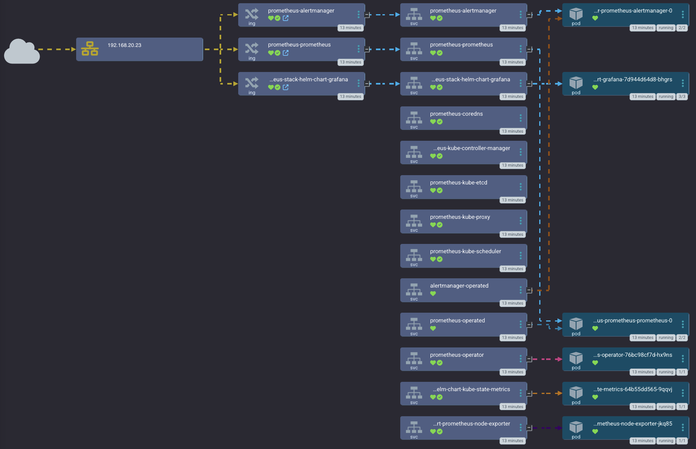

# Prometheus Stack App of Apps
Everything you need for a fully functioning monitoring stack managed by RenovateBot and Argo CD.
This doesn't seem like a big deal, but trust me, it is very much a pain to do manually.

This app utilizes the [ApplicationSet Secret Plugin Generator](https://github.com/jessebot/argocd-appset-secret-plugin) so follow the directions there if you haven't already, so that Argo CD can populate the appropriate templated values in the ApplicationSet.


#### Netflow


## directory structure

- [crds/](./crds) - Prometheus Operator Custom Resource Definitions
- [app_of_apps/](./app_of_apps) - main stable prometheus stack
- [app_of_apps_with_matrix/](./app_of_apps_with_matrix) - experimental prometheus stack utilizing matrix for alerting

## Sync Waves
1. Kube Prometheus Stack Custom Resource Definitions
2. Kube Prometheus Stack helm chart:
   - Prometheus for metric collection
   - Grafana for dashboards and visualizations
   - Alert Manager for alerting based on metrics
3. Prometheus Push Gateway for apps to push metrics
4. Loki stack (including promtail) for collecting logging into prometheus

## To deploy this app of Apps
Either create this file, and do a `kubectl apply -f` or through the GUI, select "ceate new app" and then "edit as YAML" and paste this in:

```yaml
---
apiVersion: argoproj.io/v1alpha1
kind: Application
metadata:
  name: monitoring-app-of-apps
  namespace: argocd
spec:
  project: prometheus
  source:
    repoURL: 'https://github.com/small-hack/argocd-apps'
    targetRevision: main
    path: prometheus/app_of_apps/
  destination:
    server: "https://kubernetes.default.svc"
    namespace: prometheus
  syncPolicy:
    syncOptions:
      - Replace=true
    automated:
      prune: true
      selfHeal: true
```

# Deploying Prometheus stack to k8s with ArgoCD

This will deploy:

- Prometheus
- Alert Manager for prometheus
- Grafana

Ref for prometheus giant chart of charts:
https://blog.ediri.io/kube-prometheus-stack-and-argocd-23-how-to-remove-a-workaround

## Enable Nginx Ingress metrics

- [Reccommeneded Ingress Metrics dashboard](https://grafana.com/grafana/dashboards/14314-kubernetes-nginx-ingress-controller-nextgen-devops-nirvana/)

1. Patch the Nginx Ingress controller to enable the metrics exporter

    ```bash
    helm upgrade ingress-nginx ingress-nginx \
    --repo https://kubernetes.github.io/ingress-nginx \
    --namespace ingress \
    --set controller.metrics.enabled=true \
    --set-string controller.podAnnotations."prometheus\.io/scrape"="true" \
    --set-string controller.podAnnotations."prometheus\.io/port"="10254"
    ```

2. Create a yaml file containing your prometheus scrape configs, for example:

      ```yaml
      - job_name: "nginx-ingress"
        static_configs:
        - targets: ["ingress-nginx-controller-metrics.ingress-nginx.svc.cluster.local:10254"]
      - job_name: "postgres"
        static_configs:
        - targets: ["postgres-postgresql-metrics.default.svc.cluster.local:9187"]
      - job_name: "nvidia-smi"
        static_configs:
        - targets: ["nvidia-dcgm-exporter.default.svc.cluster.local:9400"]
      ```

3. Convert the file to a secret. Name of secret must match what is set in the helm `values.yaml`

      ```bash
      wget https://raw.githubusercontent.com/small-hack/argocd-apps/main/prometheus/scrape-targets.yaml

      kubectl create secret generic additional-scrape-configs --from-file=scrape-targets.yaml \
      --dry-run=client -oyaml > additional-scrape-configs.yaml

      kubectl apply -f additional-scrape-configs.yaml -n prometheus
      ```

# Prometheus Push Gateway

Push metrics instead of scraping them
It should be used only for process that run infrequently or too quickly to be scraped properly.

## Resources:

Helm Chart Source:
- https://github.com/prometheus-community/helm-charts/tree/main/charts/prometheus-pushgateway

When to use the Push Gateway:
- https://prometheus.io/docs/practices/pushing/

Pushing Metrics:
- https://prometheus.io/docs/instrumenting/pushing/

Push metrics from a unix shell:
- https://github.com/prometheus/pushgateway/blob/master/README.md

Use the push gateway with the kube-prometheus-stack:
- https://github.com/prometheus-community/helm-charts/issues/2030#issuecomment-1585471558

# Loki

like Prometheus, but for logs

- Loki is a horizontally-scalable, highly-available, multi-tenant log aggregation system inspired by Prometheus.
- It is designed to be very cost effective and easy to operate.
- It does not index the contents of the logs, but rather a set of labels for each log stream.

See: https://github.com/grafana/loki

### Coming soon
 Soon you'll also be able to use [smol-k8s-lab](https://github.com/small-hack/smol-k8s-lab) to deploy this.
