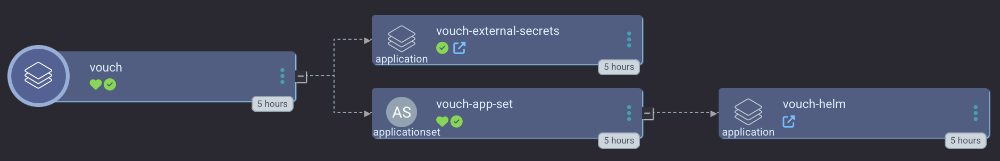

# Vouch Proxy

Vouch is an OAuth / OIDC proxy solution for Nginx using the `auth_request` module. 
It forces visitors to login and authenticate with an `Identity Provider` before allowing them access to a website. This is useful as you only need to add some annotations to an ingress-nginx Ingress resource to use vouch on websites that otherwise don't have any authentication (like prometheus).



See the official [vouch-proxy repo](https://github.com/vouch/vouch-proxy) for more info.

## Sync Waves

If you're using the App of Apps in the [./app_of_apps](./app_of_apps) directory, we have two sync waves:

1. ExternalSecrets - for the vouch and oauth provider configs
2. Vouch helm chart


If you're using the plain vouch app without external secrets in the [./basic](./basic) directory, there is only one sync wave as there is only one app, the vouch helm chart.

## Notes

Debugging tools: https://oidcdebugger.com/ + set vouch to `testing` mode in the external secret

Example ingress-nginx Ingress annotation:

```yaml
# {{ .vouch_hostname }} should be YOUR hostname you use for vouch
# e.g. vouch.example.com

annotations:
  nginx.ingress.kubernetes.io/auth-signin: "https://{{ .vouch_hostname }}/login?url=$scheme://$http_host$request_uri&vouch-failcount=$auth_resp_failcount&X-Vouch-Token=$auth_resp_jwt&error=$auth_resp_err"
  nginx.ingress.kubernetes.io/auth-url: https://{{ .vouch_hostname }}/validate
  nginx.ingress.kubernetes.io/auth-response-headers: X-Vouch-User
  nginx.ingress.kubernetes.io/auth-snippet: |
    auth_request_set $auth_resp_jwt $upstream_http_x_vouch_jwt;
    auth_request_set $auth_resp_err $upstream_http_x_vouch_err;
    auth_request_set $auth_resp_failcount $upstream_http_x_vouch_failcount;
    # when VP is hosted externally to k8s ensure the SSL cert is valid to avoid MITM risk
    proxy_ssl_trusted_certificate /etc/ssl/certs/ca-certificates.crt;
    proxy_ssl_session_reuse on;
    proxy_ssl_verify_depth 2;
    proxy_ssl_verify on;
```
