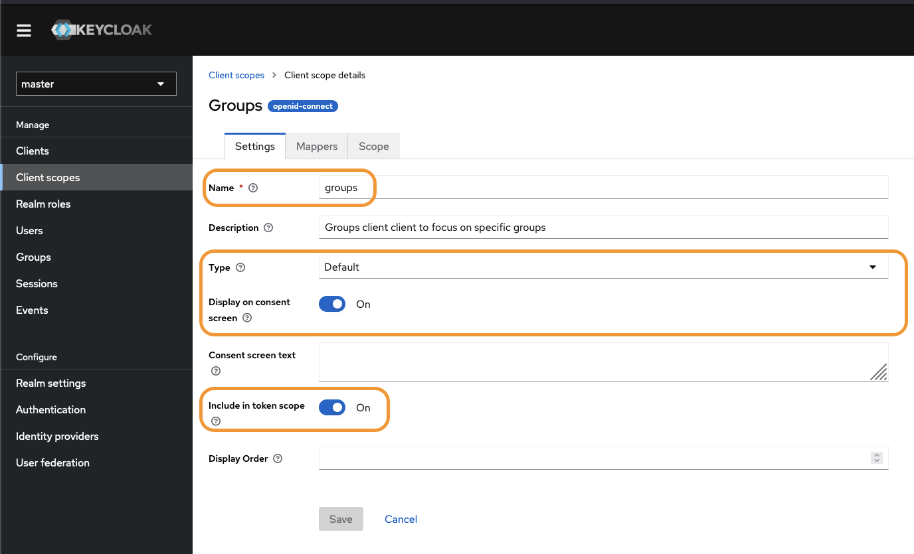
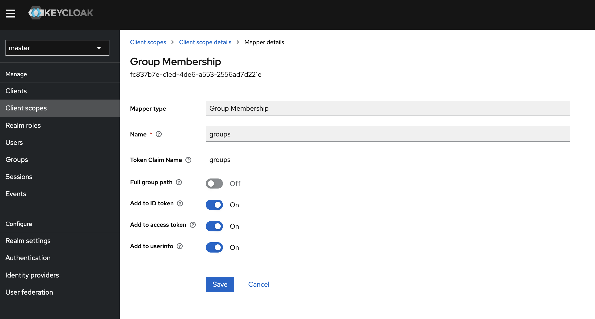

# steps to setup keycloak with argocd

1. Create a _Client_ with these values and nothing else:


2. Create a _Client Scope_ for groups:


3. Create a token mapper using _Group Membership_. You can find the menu to create that here after clicking the "Add Mapper" button:


And then make sure you fill out the Mapper details here like this:



4. Assign the new _**groups**_ _Client Scope_ to the argocd _Client_ we created earlier


5. create a group for use in the client


Here's a Kubernetes Secret containing a Vouch config that uses keycloak as the OIDC provider:

```yaml
apiVersion: v1
kind: Secret
metadata:
  name: vouch-existing-secret
stringData:
  config.yaml: |
    vouch:
      logLevel: debug
      testing: false
      domains:
      - example.com
      whiteList:
      - myuser@myemaildomain.com
      allowAllUsers: false
      cookie:
        maxAge: 900
        secure: true
        domain: example.com
    oauth:
      provider: oidc
      client_id: vouch
      client_secret: 8943hncds9aavy89hn39ncdsa89y79vh79as 
      auth_url: https://iam.example.com/realms/example-realm/protocol/openid-connect/auth
      token_url: https://iam.example.com/realms/example-realm/protocol/openid-connect/token
      user_info_url: https://iam.example.com/realms/example-realm/protocol/openid-connect/userinfo
      scopes:
        - openid
        - email
        - profile
      callback_urls:
        - https://vouch.example.com/auth
      preferredDomain:
```
