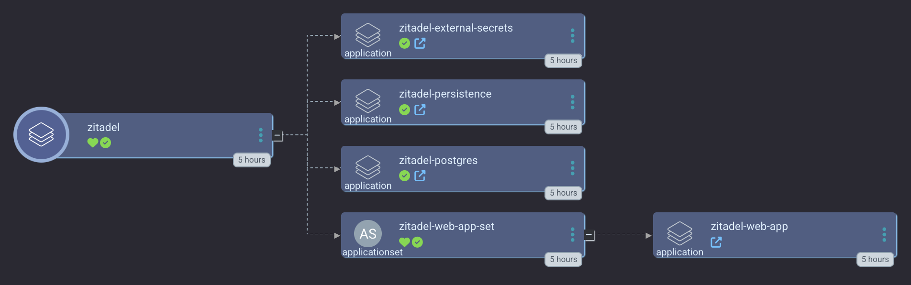
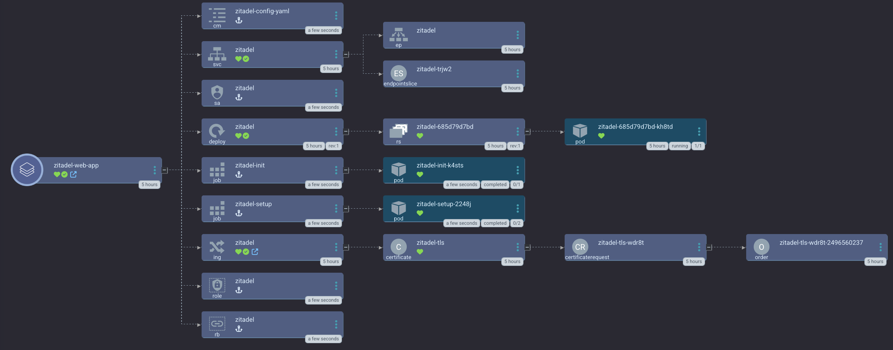
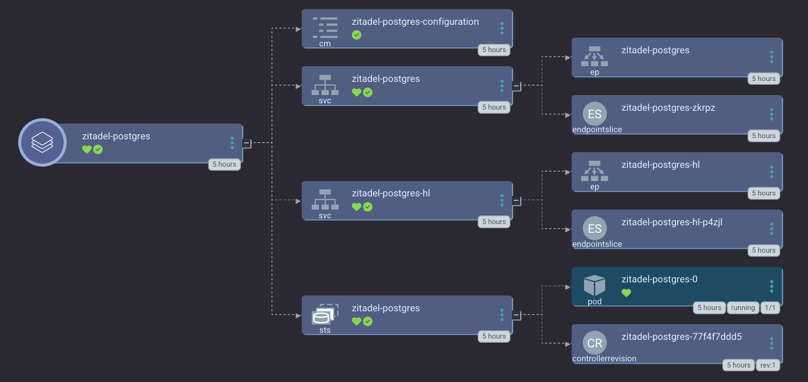

# An Argo CD App for Zitadel

[ZITADEL](https://github.com/zitadel/zitadel/tree/main) is an identity management and provider application similar to Keycloak. It helps you manage your users across apps and acts as your OIDC provider. It's community have been really nice, so we'll be supporting some Argo CD apps here instead of using Keycloak. Here's the [Zitadel helm chart](https://github.com/zitadel/zitadel-charts/tree/main) that we're deploying here.

It's important to take a look at the [`defaults.yaml`](https://github.com/zitadel/zitadel/blob/main/cmd/defaults.yaml) to see what the default `ConfigMap` will look like for Zitadel.

This Argo CD app of apps is designed to be pretty locked down to allow you to use **only** a default service account (that also can't log in through the UI) to do all the heavy lifting with openTofu, Pulumi, or your own self service script. We support only PostgreSQL as the database backend.

The main magic happens in the [app_of_apps](./app_of_apps) directory.





## Sync waves

1. - External Secrets for both your database postgresql and zitadel:
     - Zitadel database credentials
     - Zitadel `masterkey` Secrets
   - MinIO Tenant (if you use directoryRecursion: true)
2. Minio Setup Script - this sets up your minio user for postgresql and its policy
3. Postgresql cluster via the Cloud Native Postgresql Operator including the database init described [here](https://github.com/zitadel/zitadel/tree/0386fe7f96cc8c9ff178d29c9bbee3bfe0a1a568/cmd/initialise/sql/postgres)
4. Zitadel helm chart with ONLY a service account and registration DISABLED

## Usage

To deploy Zitadel and PostgreSQL _without_ an isolated MinIO tenant for PostgreSQL backups:
```bash
argocd app create zitadel --upsert --repo https://github.com/small-hack/argocd-apps --path zitadel/app_of_apps --sync-policy automated --self-heal --auto-prune --dest-namespace zitadel --dest-server https://kubernetes.default.svc
```

To deploy Zitadel and PostgreSQL with an isolated MinIO tenant for PostgreSQL backups:
```bash
argocd app create zitadel --upsert --repo https://github.com/small-hack/argocd-apps --path zitadel/app_of_apps --sync-policy automated --self-heal --auto-prune --dest-namespace zitadel --dest-server https://kubernetes.default.svc --directory-recursion
```

## Zitadel OIDC for logging into Argo CD with Zitadel as the SSO

Check out this [PR](https://github.com/argoproj/argo-cd/pull/15029)

## Using the Zitadel API

The API docs are [here](https://zitadel.com/docs/category/apis).

For Actions (needed for Argo CD and Zitadel to work nicely) you probably want this [link](https://zitadel.com/docs/category/apis/resources/mgmt/actions)

## Helm testing locally

Zitadel has an official guide for k8s deployments [here](https://zitadel.com/docs/self-hosting/deploy/kubernetes).

## TODO
Find a graceful way to setup SMTP or not. Here's the configuration parameters that would need to be set:

```yaml
DefaultInstance:
  # this configuration sets the default email configuration
  SMTPConfiguration:
    # Configuration of the host
    SMTP:
      # must include the port, like smtp.mailtrap.io:2525. IPv6 is also supported, like [2001:db8::1]:2525
      Host: # ZITADEL_DEFAULTINSTANCE_SMTPCONFIGURATION_SMTP_HOST
      User: # ZITADEL_DEFAULTINSTANCE_SMTPCONFIGURATION_SMTP_USER
      Password: # ZITADEL_DEFAULTINSTANCE_SMTPCONFIGURATION_SMTP_PASSWORD
    TLS: # ZITADEL_DEFAULTINSTANCE_SMTPCONFIGURATION_SMTP_SSL
    # If the host of the sender is different from ExternalDomain set DefaultInstance.DomainPolicy.SMTPSenderAddressMatchesInstanceDomain to false
    From: # ZITADEL_DEFAULTINSTANCE_SMTPCONFIGURATION_SMTP_FROM
    FromName: # ZITADEL_DEFAULTINSTANCE_SMTPCONFIGURATION_SMTP_FROMNAME
  DomainPolicy:
    SMTPSenderAddressMatchesInstanceDomain: false
```

## Writing an action to send a groupsClaim

```js
function groupsClaim(ctx, api) {
  if (ctx.v1.user.grants === undefined || ctx.v1.user.grants.count == 0) {
    return;
  }

  let grants = [];
  ctx.v1.user.grants.grants.forEach(claim => {
    claim.roles.forEach(role => {
      grants.push(role)
    })
  })

  api.v1.claims.setClaim('groups', grants)
}
```

## Writing an action to send a claim in an OIDC response

Here's an example action script that we've called nextcloudAdminClaim. It iterates through the user's roles and if one of them is `nextcloud_admins` it sends a claim it calls `nextcloud_admin` back with a true value, else it sends back false.

```js
function nextcloudAdminClaim(ctx, api) {

  if (ctx.v1.user.grants === undefined || ctx.v1.user.grants.count == 0) {
    return;
  }

  ctx.v1.user.grants.grants.forEach(claim => {
    if (claim.roles.includes('nextcloud_admins') {
        api.v1.claims.setClaim('nextcloud_admin', true)
        return;
        }

    if (claim.roles.includes('nextcloud_users') {
        api.v1.claims.setClaim('nextcloud_admin', false)
        return;
        }
    }
}
```
